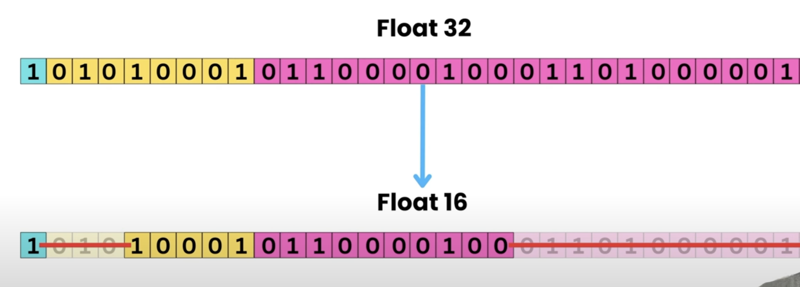

# Why Inference Optimization Matters

Inference optimization is crucial for several important reasons:

## Economic Efficiency
- **Reduced Infrastructure Costs**: Optimized models require fewer computational resources, directly lowering cloud/hardware expenses
- **Energy Savings**: More efficient inference means less power consumption, reducing electricity costs and environmental impact
- **Better Hardware Utilization**: Optimized models make better use of existing hardware investments

## User Experience
- **Lower Latency**: Faster response times create smoother interactions for users (critical for real-time applications)
- **Improved Reliability**: Efficient models are less likely to experience performance degradation under load
- **Better Offline Performance**: Optimized models run better on devices without constant cloud connectivity

## Deployment Flexibility
- **Edge Device Compatibility**: Allows AI to run on resource-constrained devices like phones, IoT devices, and embedded systems
- **Scalability**: Serving more users with the same infrastructure
- **Reduced Bandwidth Requirements**: Less data transfer between devices and servers

## Business Impact
- **Higher Throughput**: Processing more requests per second enables serving more users
- **Reduced Time-to-Market**: Faster inference allows quicker product iterations and feature releases
- **Competitive Advantage**: Better performance than competitors' solutions

## Technical Benefits
- **Battery Life**: Critical for mobile and IoT applications where power is limited
- **Memory Constraints**: Meeting the requirements of devices with limited RAM
- **Heat Generation**: Reduced computational load means less heat, extending hardware lifespan

## Real-World Example
Consider a large language model (LLM) like GPT:
- **Unoptimized**: Might require expensive GPU clusters, have 2-5 second response times, and cost dollars per hour to run
- **Optimized**: Could run on consumer hardware, respond in milliseconds, and cost cents per hour

Inference optimization transforms AI from a research curiosity into a practical, deployable technology that can be integrated into everyday products and services. It's the bridge between what's theoretically possible and what's practically useful.


# Inference Optimization Techniques for Model Deployment


## Hardware Acceleration Techniques
- **GPU Acceleration**: Utilizing NVIDIA GPUs with CUDA for parallel processing
- **TPU Deployment**: Using Google's Tensor Processing Units for matrix operations
- **CPU Optimization**: Leveraging multi-threading and SIMD instructions
- **FPGA Implementation**: Custom hardware acceleration for specific models
- **ASIC Deployment**: Application-specific integrated circuits for maximum efficiency

## Quantization Methods
- **Post-training quantization**: Converting FP32 to INT8/INT4 after training
- **Quantization-aware training**: Training models to be robust to lower precision
- **Mixed-precision inference**: Using different precision for different layers
- **Dynamic quantization**: Adjusting precision based on runtime requirements

## Model Architecture Optimization
- **Knowledge distillation**: Creating smaller student models from larger teacher models
- **Pruning**: Removing unnecessary connections while maintaining accuracy
- **Neural Architecture Search (NAS)**: Automatically finding efficient architectures
- **Model compression**: Reducing model size through various techniques

## Execution Optimization
- **Operator fusion**: Combining multiple operations into single optimized kernels
- **Kernel tuning**: Optimizing computational kernels for specific hardware
- **Graph optimization**: Restructuring the computation graph for efficiency
- **Batching**: Processing multiple inputs simultaneously
- **Caching**: Storing intermediate results for reuse

## Deployment Strategies
- **Model serving frameworks**: TensorRT, ONNX Runtime, TorchServe
- **Edge deployment**: Optimizing for resource-constrained devices
- **Serverless deployment**: Using cloud functions for scalable inference
- **Containerization**: Docker and Kubernetes for consistent deployment


# Understanding Quantization in Language Models

## 1. How Weights Are Stored: Floating-Point Numbers

Neural network weights are typically stored as floating-point numbers. These numbers provide a way to represent a wide range of values with varying precision.

### Floating-Point Number Structure

A floating-point number consists of three components:
- **Sign bit**: Determines whether the number is positive (0) or negative (1)
- **Exponent**: Determines the magnitude of the number
- **Mantissa (or fraction)**: Determines the precision of the number

The general formula for a floating-point number is:
```
Value = (-1)^sign × (1 + mantissa) × 2^(exponent - bias)
```

### Common Floating-Point Formats

**FP32 (32-bit floating-point)**
- 1 bit for sign
- 8 bits for exponent (bias of 127)
- 23 bits for mantissa
- Range: Approximately ±1.18 × 10^-38 to ±3.4 × 10^38
- Precision: About 7 decimal digits

**FP16 (16-bit floating-point)**
- 1 bit for sign
- 5 bits for exponent (bias of 15)
- 10 bits for mantissa
- Range: Approximately ±6.1 × 10^-5 to ±65,504
- Precision: About 3-4 decimal digits

**BF16 (Brain Floating Point)**
- 1 bit for sign
- 8 bits for exponent (same as FP32)
- 7 bits for mantissa
- Maintains the range of FP32 but with reduced precision

**INT8 (8-bit integer)**
- Not floating-point, but used in quantization
- Range: -128 to 127 (signed) or 0 to 255 (unsigned)
- No inherent representation of fractional values


#### 1.2 Comparision of Range between different formats


## 2. Conversion of one format to other?





## 2. What is Quantization?

Quantization is the process of reducing the precision of numerical representations in a model, typically from higher-precision floating-point (like FP32) to lower-precision formats (like FP16, INT8, or even lower). This process significantly reduces model size and computational requirements while aiming to maintain acceptable model performance.

### Example: Converting FP32 to FP16

Let's consider a weight value: 0.7568359375

**In FP32 representation:**
- Sign bit: 0 (positive)
- Decimal to binary: 0.7568359375 = 0.11000001 in binary
- Normalized scientific notation: 1.1000001 × 2^-1
- Exponent: -1 + 127 (bias) = 126 = 01111110 in binary
- Mantissa: 10000010000000000000000 (23 bits)
- FP32 representation: 0 01111110 10000010000000000000000

**Converting to FP16:**
- Sign bit remains 0
- Exponent: -1 + 15 (bias) = 14 = 01110 in binary
- Mantissa: Truncate to 10 bits: 1000001000
- FP16 representation: 0 01110 1000001000

### Example: Converting FP32 to INT8

For converting to INT8, we need a scaling factor:

1. Determine the range of values in our weights (e.g., -2.5 to 2.5)
2. Map this range to INT8 range (-128 to 127)
3. Scaling factor = (2.5 - (-2.5)) / (127 - (-128)) = 5/255 ≈ 0.0196

For our value 0.7568359375:
- Scaled integer = round(0.7568359375 / 0.0196) = round(38.6) = 39
- INT8 representation: 39

To recover an approximation of the original value:
- Recovered value = 39 × 0.0196 = 0.7644
- Quantization error = 0.7644 - 0.7568359375 = 0.0075640625


### Advanced Bit reprentation Techniques

- **NF4 (4-bit Normal Float)**: A 4-bit floating-point format optimized for neural network weights, designed to better represent the normal distribution patterns typical in weights.

- **Double Quantization (DQ)**: Applies quantization in two stages - first to the weights, then to the scaling factors themselves, further reducing memory requirements.

- **Activation-Aware Weight Quantization (AWQ)**: Identifies and preserves the most important weights for each activation, allowing for effective lower-bit quantization.


# NF4 (4-bit Normal Float) Explained


NF4 is a specialized 4-bit floating-point format designed specifically for neural network weight quantization. It helps reduce model size while maintaining performance, which is crucial for deploying large language models efficiently.

## Core Concepts of NF4

NF4 uses a 4-bit representation (16 possible values) where:
- The values are distributed according to a normal distribution
- This matches the statistical distribution of weights in neural networks
- Unlike standard floating-point formats, NF4 doesn't have explicit sign, exponent, and mantissa fields

## How NF4 Quantization Works

The quantization process converts 32-bit floating-point weights to 4-bit NF4 values:

1. **Analysis Phase**: The quantizer analyzes the weight tensor's distribution
2. **Scaling**: The weights are scaled to fit within the NF4 representable range
3. **Mapping**: Each original weight is mapped to the nearest representable NF4 value
4. **Storage**: The 4-bit indices are stored instead of full-precision weights


## How NF4 Dequantization Works

To use the model during inference:

1. **Lookup**: The 4-bit indices are used to look up the corresponding NF4 values
2. **Inverse Scaling**: The values are scaled back to the original range
3. **Computation**: Matrix multiplications are performed with the dequantized values

## Example of NF4 Quantization

Let's walk through a simplified example:

```
Original weights (FP32): [-1.8, -0.7, 0.3, 1.2, 2.5]

Step 1: Determine scale factor based on the range of values
   Scale = 2.5 / max_NF4_value ≈ 0.31

Step 2: Map each value to the closest NF4 representation
   -1.8 → quantized to -1.76 (index 1)
   -0.7 → quantized to -0.67 (index 5)
    0.3 → quantized to 0.31 (index 9)
    1.2 → quantized to 1.16 (index 12)
    2.5 → quantized to 2.41 (index 15)

Step 3: Store 4-bit indices: [1, 5, 9, 12, 15]
```

During dequantization, we reverse the process by mapping these indices back to the corresponding NF4 values and applying the scale factor.

## Advantages of NF4

- **Storage Efficiency**: 8× reduction in model size compared to FP32
- **Distribution-Matched**: Better preserves model accuracy than uniform quantization
- **Inference Speed**: Enables faster inference on hardware that supports 4-bit operations
- **Memory Bandwidth**: Reduces memory traffic, a common bottleneck in LLM inference

NF4 is particularly effective because neural network weights typically follow a normal distribution, making it a natural choice for preserving the most important weights while minimizing quantization error.


## 3. Quantization Techniques


### Post-Training Quantization (PTQ)

PTQ applies quantization to a trained model without retraining. It's the simplest approach and includes:

- **Static Quantization**: Determines scaling factors using a calibration dataset and applies them to both weights and activations.
- **Dynamic Quantization**: Computes scaling factors for activations on-the-fly during inference, while weights use pre-computed scales.
- **Weight-Only Quantization**: Only quantizes the model weights, leaving activations in their original precision.

### Quantization-Aware Training (QAT)

QAT incorporates the effects of quantization during the training process, allowing the model to adapt to the reduced precision. This often provides better accuracy than PTQ but requires retraining the model.


source: https://ai.google.dev/edge/litert/models/post_training_quantization


## Key Temology:

---

## 🧠 What is "Activation" in Neural Networks?

In a neural network, **activation** refers to the **output of a layer after applying the activation function**.

Each layer in a neural network performs a linear transformation (like a matrix multiplication) on the inputs. The result is passed through an **activation function** (like ReLU, sigmoid, etc.) to introduce non-linearity into the model. The **output after this function is called the activation**.

---

### 🧪 Example: Dummy Neural Network

Let’s build a tiny example in PyTorch (or NumPy-style pseudo-code) to make it concrete:

```python
import torch
import torch.nn as nn

# A dummy neural network
class TinyNet(nn.Module):
    def __init__(self):
        super(TinyNet, self).__init__()
        self.fc1 = nn.Linear(4, 3)  # Layer 1: input size 4, output size 3
        self.relu = nn.ReLU()       # Activation function
        self.fc2 = nn.Linear(3, 2)  # Layer 2: input size 3, output size 2

    def forward(self, x):
        out1 = self.fc1(x)       # Linear output
        act1 = self.relu(out1)   # Activation (this is what we call 'activation')
        out2 = self.fc2(act1)    # Final output
        return out2

# Create an instance and pass a dummy input
model = TinyNet()
dummy_input = torch.tensor([[1.0, 2.0, 3.0, 4.0]])
output = model(dummy_input)
```

Here’s a breakdown:
- `out1` is the result of the first `Linear` layer (a dot product + bias).
- `act1` is the **activation** — the output of applying ReLU to `out1`.
- This `act1` is what gets **quantized** during **activation quantization**.

---

### 🧊 What Happens During Quantization?

In **Post-Training Quantization (PTQ)**, you might convert `act1` from a 32-bit floating-point tensor to an 8-bit integer tensor. This reduces memory and speeds up inference.

### 📉 Why Quantize Activations?

- **Activations** change during each input inference.
- Quantizing them reduces **runtime memory footprint** and can accelerate inference on hardware that supports low-precision ops.

---

### 📝 Summary

| Term         | Meaning                                                     |
|--------------|-------------------------------------------------------------|
| **Weights**  | Parameters learned during training (fixed after training).  |
| **Activations** | Outputs of layers (after non-linear functions like ReLU). |
| **Quantizing Activations** | Storing and computing with activations in lower precision (like INT8) instead of float32. |

Let me know if you want a NumPy version or a visualization!

# Understanding Scale Factor and Zero Point in Quantization

When quantizing deep learning models from floating-point precision to lower-precision integer representations, two key parameters are used: the **scale factor** and the **zero point**. These parameters are essential for maintaining the model's accuracy while reducing its computational and memory requirements.


### Symmetric Quantization
---


### Asymmetric Quantization
---


#### Precision Conversion


## Purpose of Quantization Parameters

The fundamental purpose of scale factor and zero point is to map the original floating-point range to a limited integer range while preserving as much information as possible. This mapping is necessary because:

1. Floating-point numbers have a much wider dynamic range than integers
2. Deep learning models operate on real values that must be represented in a constrained integer space
3. We need to maintain the relative relationships between values to preserve the model's behavior

## Scale Factor (α)

The scale factor determines the "step size" between representable values in the quantized space.

**Mathematical Definition:**
```
scale = (float_max - float_min) / (int_max - int_min)
```

**Example:** If your floating-point values range from -10.0 to +10.0, and you're quantizing to INT8 (-128 to +127), the scale would be:
```
scale = (10.0 - (-10.0)) / (127 - (-128)) = 20.0 / 255 ≈ 0.078
```

This means each step in the integer domain represents approximately 0.078 in the floating-point domain.

**Why it's needed:**
- Ensures proper proportional representation of values
- Determines the quantization granularity
- Controls the resolution of the quantized values

## Zero Point (z)

The zero point is the integer value that represents the floating-point zero in the quantized space.

**Mathematical Definition:**
```
zero_point = round(int_min - float_min / scale)
```
or alternately:
```
zero_point = round(-float_min / scale + int_min)
```

**Example:** Using the same example as above:
```
zero_point = round(-(-10.0) / 0.078 + (-128)) ≈ round(128 - 128) = 0
```

**Why it's needed:**
- Ensures zero in the floating-point domain maps to a representable value in the integer domain
- Crucial for asymmetric quantization where the floating-point range isn't centered around zero
- Allows efficient representation of data that is naturally biased (e.g., activation functions like ReLU that produce only positive values)

## The Quantization and Dequantization Process

### Quantization (float → int):
```
int_value = round(float_value / scale) + zero_point
```

### Dequantization (int → float):
```
float_value = (int_value - zero_point) * scale
```

## Why These Parameters Are Critical

1. **Precision Preservation**
   - Without proper scaling, quantization would cause significant information loss
   - The scale factor ensures the dynamic range is preserved as much as possible

2. **Value Distribution Alignment**
   - Neural networks often have asymmetric value distributions
   - Zero point allows proper handling of this asymmetry

3. **Computational Efficiency**
   - Enables efficient integer-only arithmetic during inference
   - Critical for hardware acceleration on devices without floating-point units

4. **Handling Different Layers**
   - Different layers have different value distributions
   - Per-tensor or per-channel quantization parameters allow optimized representation across the network

5. **Reducing Quantization Error**
   - Properly chosen scale and zero point minimize the mean squared error between original and quantized values

## Practical Considerations

- **Symmetric vs. Asymmetric Quantization:**
  - Symmetric: zero_point = 0, simplifies computation but may waste range for asymmetric distributions
  - Asymmetric: non-zero zero_point, better utilizes the available integer range

- **Per-Tensor vs. Per-Channel Quantization:**
  - Per-tensor: single scale/zero-point pair for entire tensor
  - Per-channel: different parameters for each output channel, more accurate but more complex

- **Parameter Storage:**
  - Scale factors are typically stored in floating-point
  - Zero points are stored in the same format as the quantized data or as int32

By properly selecting scale factors and zero points, quantization can significantly reduce model size and improve inference speed while maintaining acceptable accuracy for deployment on resource-constrained devices.
