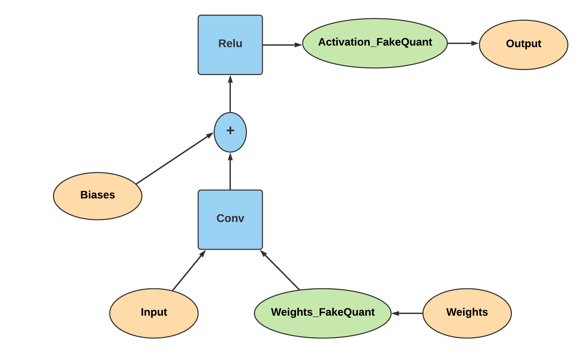
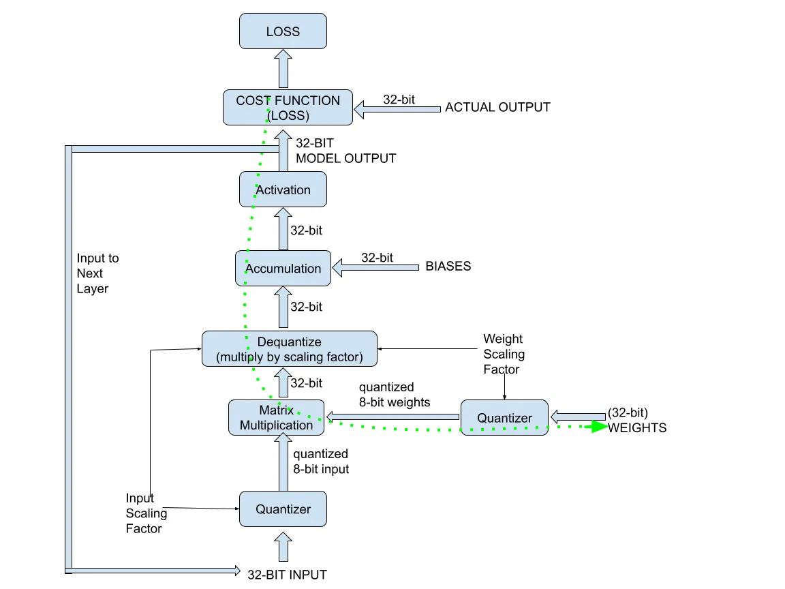
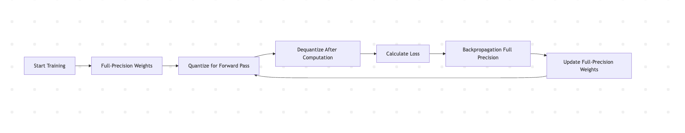

Source: https://medium.com/data-science/quantizing-neural-network-models-8ce49332f1d3

---

# 📦 Quantization Aware Training (QAT) — A Simplified Guide

## 🧠 What is QAT?

**Quantization Aware Training (QAT)** is a training technique where a model learns to work with **quantized (low-precision) weights** *during* training. This helps the model adapt to the kind of limitations it will face during real-world deployment (like on mobile devices or edge hardware).

It's a more advanced alternative to **Post Training Quantization (PTQ)**, where quantization happens *after* training.

---

## 🔀 Two Approaches to QAT

There are two main ways to perform QAT:

1. **Train from scratch** using quantized weights.
2. **Fine-tune a pre-trained model** with quantization added — often a hybrid and more practical approach.

In most real-world scenarios, you start with a **pre-trained model** and then apply QAT to improve performance under quantization constraints.

---

## ✅ Pros and ❌ Cons of QAT

### ✅ Advantages
- The model **learns to perform well with quantized weights**, leading to better real-world accuracy.
- The **inference process matches the training process**, avoiding surprises at deployment.

### ❌ Disadvantages
- It’s **resource-intensive**: models need to be retrained with QAT.
- It's still uncertain whether QAT models can **match the performance** of full-precision models in *every* use case.
- **Scalability** of quantized models to larger tasks remains an open question.

---

## 🕰️ A Brief History of QAT

- **2015**: *Courbariaux et al.* introduced **BinaryConnect**, a method using binary weights in forward passes but full precision in backpropagation.
- **2017**: *Jacob et al.* (Google) proposed **simulated quantization**, which essentially laid the foundation for QAT — even though the term "QAT" wasn’t explicitly used.

---


## 🔄 How QAT Works — Step-by-Step

Here’s a high-level overview of the QAT training process:



### 1. Keep Two Copies of Weights
- Maintain **full-precision (unquantized)** weights (called *latent weights* or *shadow weights*).
- During training, use **quantized** versions only for the **forward pass**.

### 2. Forward Pass (Inference Simulation)
- **Quantize** weights and inputs.
- Perform matrix multiplication (e.g., convolutions).
- **Dequantize** the result of the multiplication.
- Add unquantized biases.
- Pass the result through the **activation function**.
- Calculate the **loss**.

### 3. Backward Pass (Training)
- Use **full-precision weights** for computing gradients.
- Update the **full-precision weights** using standard gradient descent.
- Repeat this cycle for all training batches.

> This technique is sometimes called **“fake quantization”** — training happens with unquantized weights, but the forward pass simulates quantization.




---

## 🔁 QAT Flow Summary





> ⚠️ The **dotted arrow** in some diagrams usually shows the backpropagation path — it uses gradients from the quantized forward pass to update unquantized weights.

---

## 🔙 Understanding Backpropagation with QAT

### Normal Case (Full Precision)
In a standard neural network:
- Inputs = `X`, Weights = `W`, Bias = `B`
- Activation output: `A = sigmoid(XW + B)`
- Loss = difference between prediction and actual output
- Gradients:  
```math

  \frac{\partial C}{\partial W}

```

### With Quantization
When weights are quantized:

- You now deal with:  
```math
  \frac{\partial C}{\partial Q(W)} \cdot \frac{\partial Q(W)}{\partial W}
```
- The extra term  
```math

  \frac{\partial Q(W)}{\partial W}
```
  accounts for the **quantizer function's effect** on gradients.

---

## ⚙️ The Quantizer Function and Its Derivative

The **quantizer function** simplifies weights like this:

\[
Q(w) = \text{round}(w / s) \times s
\]

Where:
- `w` is the original weight
- `s` is the scale factor


---

## 🧾 Summary

| Aspect | Details |
|--------|---------|
| What | Training with quantized weights during forward pass |
| Why | Helps models adapt to low-precision deployment environments |
| How | Forward pass: quantized; Backward pass: full precision |
| Trick | Uses **Straight-Through Estimator** to handle non-differentiable quantization |
| Result | Better model performance when deployed with quantized weights |

---

## 📌 Key Takeaways

- QAT makes models **ready for deployment** in resource-constrained environments.
- It’s more complex and resource-heavy than PTQ, but **often yields better results**.
- Understanding the **forward/backward pass split** and **STE** is key to implementing QAT effectively.

---

Let me know if you want this turned into a Jupyter Notebook, presentation, or code-friendly documentation!