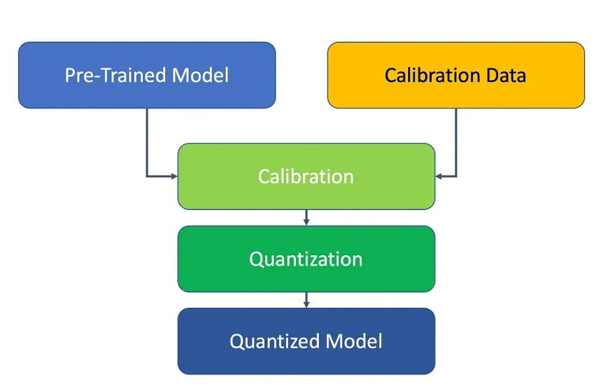

# Post-Training Quantization Types

Post-Training Quantization (PTQ) is a technique to reduce model size and improve inference speed by reducing the numerical precision of weights and activations after training. Here are the main types:

## Weight-Only Quantization
- **Approach**: Only the model weights are quantized while activations remain in floating-point
- **Pros**: Simpler implementation, less accuracy impact
- **Cons**: Limited performance benefits compared to full quantization
- **Common formats**: INT8, INT4, mixed precision (e.g., W8A16)

## Weight and Activation Quantization
- **Static Quantization**: Both weights and activations are quantized to fixed precision
  - Weights are quantized during conversion
  - Activation quantization parameters are pre-computed using calibration data
  - Better performance than weight-only but may impact accuracy more

- **Dynamic Quantization**: 
  - Weights are quantized ahead of time
  - Activations are quantized on-the-fly during inference
  - Quantization parameters for activations are computed dynamically

## Calibration Techniques

Calibration is crucial for determining optimal quantization parameters (scale and zero-point). Here are the main approaches:

### Min-Max Calibration
- **Method**: Uses minimum and maximum values in the tensor
- **Formula**: scale = (max - min) / (2^bits - 1)
- **Pros**: Simple and fast
- **Cons**: Sensitive to outliers which can reduce precision for most values

### Percentile Calibration (or Clipping)
- **Method**: Clips outliers using percentiles (e.g., 99.99th) instead of absolute min/max
- **Pros**: More robust to outliers, better preservation of information for common values
- **Cons**: May lose some extreme but important values

### MSE (Mean Squared Error) Optimization
- **Method**: Finds quantization parameters that minimize the quantization error
- **Pros**: Typically achieves better accuracy than min-max
- **Cons**: More computationally expensive

### KL Divergence Minimization
- **Method**: Minimizes the KL divergence between original and quantized distributions
- **Pros**: Often provides better accuracy by preserving the statistical properties
- **Cons**: More complex, requires histogram computation

### Entropy Calibration
- **Method**: Maximizes information retention by entropy analysis
- **Pros**: Can better preserve model behavior
- **Cons**: Computationally intensive

### OMSE (Optimal MSE)
- **Method**: Analytically finds optimal clipping thresholds to minimize MSE
- **Pros**: Better accuracy than basic min-max with computational efficiency
- **Cons**: Requires computing tensor distribution statistics

### AdaRound
- **Method**: Uses a differentiable rounding mechanism to find optimal rounding values
- **Pros**: Significantly better accuracy than naive rounding
- **Cons**: Requires optimization for each weight tensor

Each calibration technique offers different tradeoffs between accuracy, computational complexity, and ease of implementation. The best choice depends on the specific model architecture and deployment constraints.