# Inference Optimization - Part 4
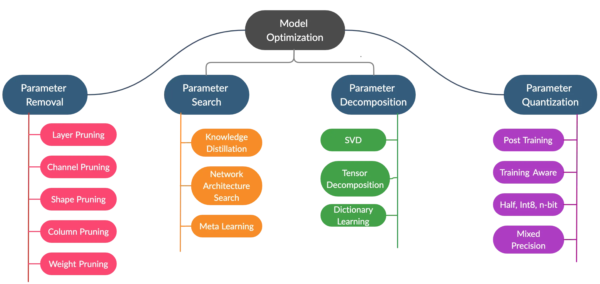

# Understanding Pruning in Neural Networks

Pruning is a model optimization technique that removes unnecessary parts of a neural network to make it smaller and more efficient while maintaining (or minimally impacting) its accuracy. Let me explain this in detail, including how it accelerates inference.

Source: https://hanlab.mit.edu/courses/2024-fall-65940
## What is Pruning?

Pruning is the process of systematically removing parameters (weights, neurons, or entire layers) from a trained neural network that contribute little to the model's output. The goal is to create a smaller, faster model that requires less memory and computational power.

### Types of Pruning on the Basis of Granularity:

# Pruning Methods at Different Levels of Granularity

Pruning in machine learning and deep neural networks refers to the process of systematically removing parameters to reduce model size while maintaining performance. Here's a breakdown of pruning techniques organized by their level of granularity, from coarsest to finest:

## Element/ Unstructured Level (Finest)
- **Weight Pruning**: Removing individual weight connections based on criteria like magnitude or importance.
- **Connection Pruning**: Similar to weight pruning but focusing on the specific connections between neurons.
- **N:M Sparsity**: Keeping only N out of M weights in each row of a weight matrix (e.g., 4:8 sparsity means keeping 4 values out of every 8).

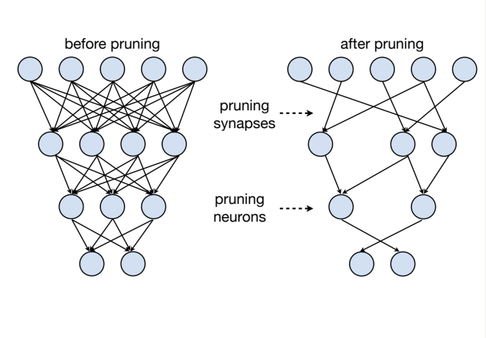

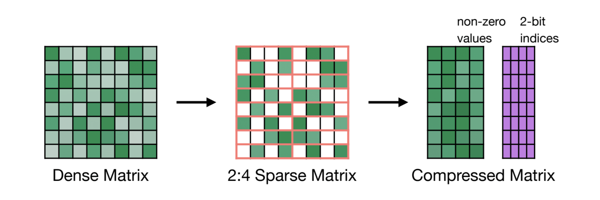

## Group Level (Medium)
- **Neuron/Unit Pruning**: Removing individual neurons along with all their incoming and outgoing connections.
- **Kernel Pruning**: Removing entire 3D kernels within convolutional filters.
- **Block Pruning**: Removing regular patterns or blocks of weights in tensors, often useful for hardware acceleration.

## Structural Level (Coarsest)
- **Model Pruning**: Selecting smaller model architectures or reducing the overall depth/width of networks.
- **Layer Pruning**: Removing entire layers from the network, particularly effective for redundant layers.
- **Filter/Channel Pruning**: Removing entire convolutional filters or channels, which reduces both model size and computation.
- **Attention Head Pruning**: In transformer models, removing entire attention heads that contribute minimally to performance.

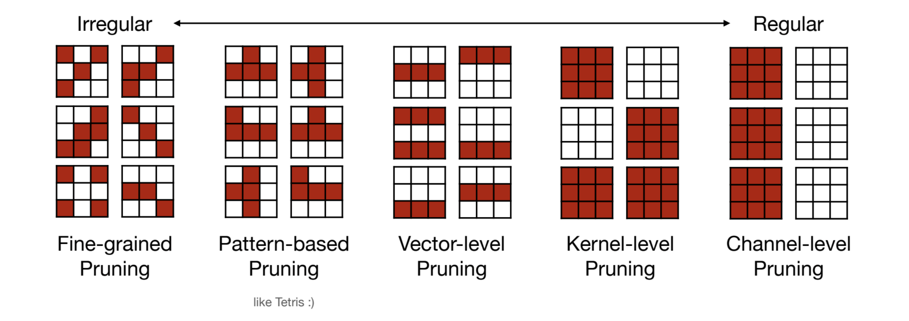

## **3. Criterion for Pruning (How to Select What to Prune)**
   - **Magnitude-Based Pruning**  
     - Prunes weights with the smallest absolute values (assuming they contribute less).  
     - Common in unstructured pruning.  
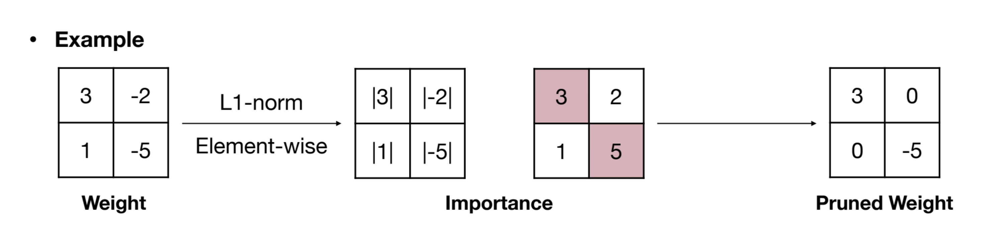

   - **Gradient-Based Pruning**  
     - Uses gradients to determine importance (weights with small gradients may be pruned).  

   - **Activation-Based Pruning**  
     - Prunes neurons with low activation values (useful for ReLU networks).  

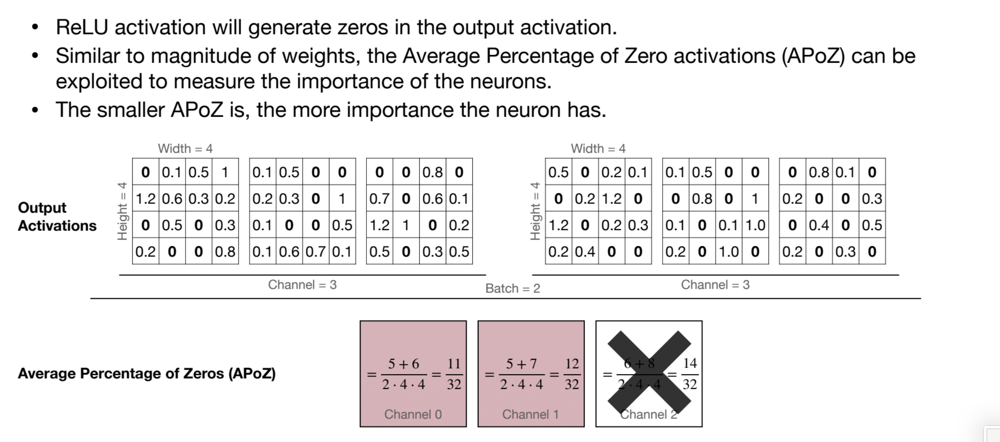

   <!-- - **Second-Order Derivate based Pruning(Taylor Expansion) Importance**  
     - Estimates the impact of removing a weight using its gradient and value.  
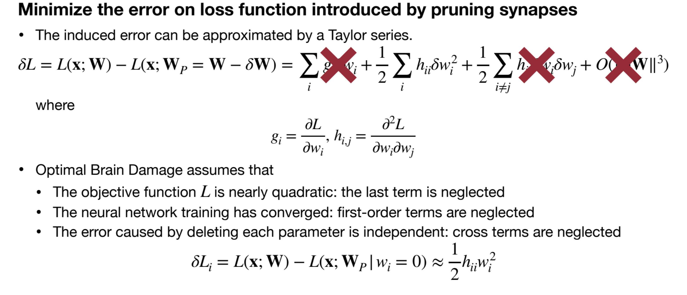 -->

   - **Scaling-Based Pruning**  

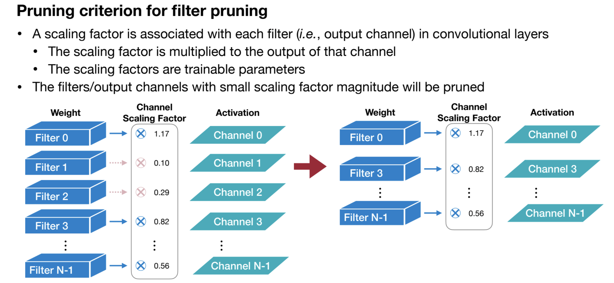

### **2. Based on Timing (When Pruning is Applied)**
   - **One-Shot Pruning**  
     - Train the model → Prune → Fine-tune (no iterative steps).  
     - Simple but may lead to suboptimal performance.  

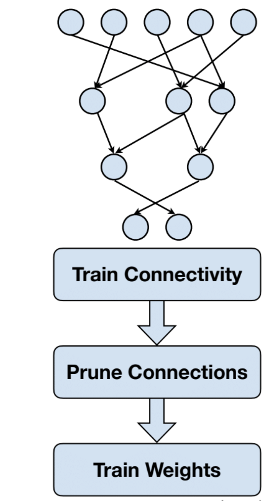

   - **Iterative Pruning**  
     - Repeatedly prune and fine-tune in cycles.  
     - Helps recover accuracy better than one-shot pruning.  
     - Example: Gradually increasing sparsity over epochs.  

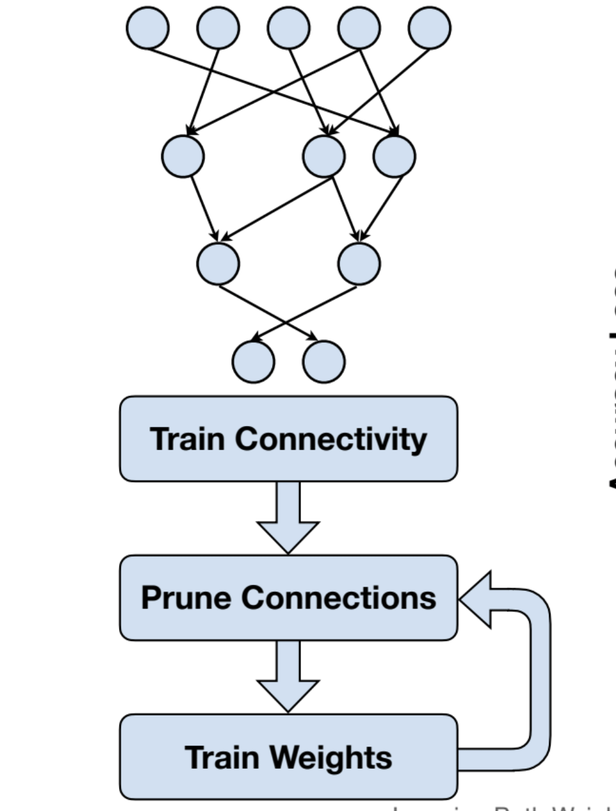
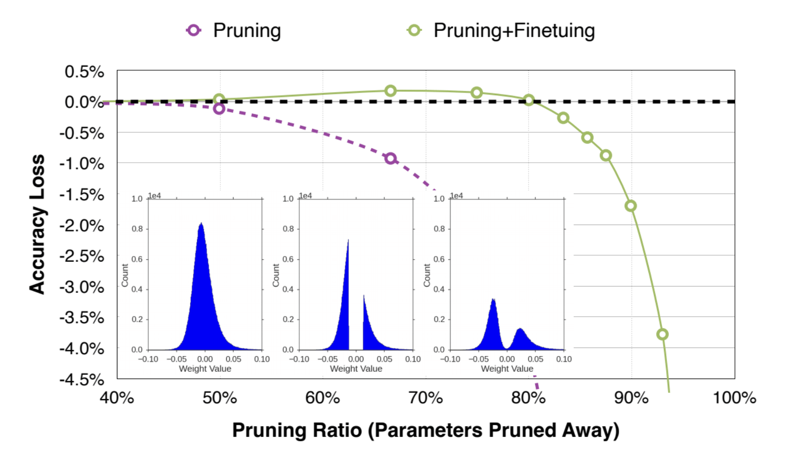

### **5. Global vs. Local Pruning**
   - **Local Pruning**  
     - Prunes each layer independently based on layer-wise thresholds.  

   - **Global Pruning**  
     - Ranks all weights (or neurons) across the network and prunes the least important ones globally.  

### **Pruning-Aware Training vs. Post-Training Pruning**
Both approaches aim to compress deep neural networks by removing redundant weights or neurons, but they differ in **when and how pruning is applied** during the model's lifecycle.

---

## **1. Pruning-Aware Training (Pruning During Training)**
Pruning-aware training integrates pruning directly into the training process, allowing the model to adapt to sparsity gradually. This often leads to better performance than post-training pruning.

### **Types of Pruning-Aware Training**
#### **(A) Iterative Magnitude Pruning (IMP)**
   - **Process**:  
     1. Train the model normally.  
     2. Prune a small fraction of low-magnitude weights.  
     3. Fine-tune the remaining weights.  
     4. Repeat pruning & fine-tuning in cycles.  
   - **Advantage**: Better accuracy recovery than one-shot pruning.  
   - **Example**: Used in the **Lottery Ticket Hypothesis (LTH)** to find sparse trainable subnetworks.  

#### **(B) Dynamic Network Surgery (Soft Pruning)**
   - **Process**:  
     - Weights are "soft-pruned" (masked but not permanently removed).  
     - Some pruned weights can regrow if they become important later.  
   - **Advantage**: More flexible than hard pruning.  

#### **(C) Gradient-Based Pruning During Training**
   - **Process**:  
     - Uses gradient information to decide which weights to prune.  
     - Example: **Movement Pruning** (weights are pruned based on their tendency to grow or shrink during training).  
   - **Advantage**: Better adaptivity than magnitude-based pruning.  

#### **(D) Regularization-Based Pruning (e.g., L1, Group Lasso)**
   - **Process**:  
     - Applies sparsity-inducing regularization (e.g., L1 penalty) during training.  
     - Forces unimportant weights toward zero, making them easy to prune later.  
   - **Example**: **Network Slimming** (uses L1 on BN layer scales to prune channels).  

---

## **2. Post-Training Pruning (Pruning After Training)**
Post-training pruning removes weights from a **pre-trained model** without further training (or with minimal fine-tuning). It is simpler but may lead to higher accuracy loss.

### **Types of Post-Training Pruning**
#### **(A) One-Shot Magnitude Pruning**
   - **Process**:  
     1. Train the model fully.  
     2. Remove weights below a certain threshold (e.g., smallest 50%).  
     3. (Optional) Fine-tune lightly.  
   - **Disadvantage**: May cause significant accuracy drop if pruning ratio is high.  

#### **(B) Layer-Wise Pruning**
   - **Process**:  
     - Prunes each layer independently (e.g., remove 30% of weights from each layer).  
     - Can be magnitude-based or activation-based.  
   - **Advantage**: Simpler than global pruning.  

#### **(C) Global Pruning**
   - **Process**:  
     - Ranks **all weights across the entire network** and prunes the smallest globally.  
   - **Advantage**: More optimal than layer-wise pruning (avoids unbalanced sparsity).  

#### **(D) Structured vs. Unstructured Post-Training Pruning**
   - **Unstructured (Weight-Level)**:  
     - Removes individual weights (leads to sparse matrices).  
     - Needs specialized hardware (e.g., NVIDIA A100 with sparse tensor cores).  
   - **Structured (Neuron/Filter-Level)**:  
     - Removes entire neurons, channels, or filters.  
     - Easier to deploy on standard hardware.  

#### **(E) Data-Driven Post-Training Pruning**
   - **Process**:  
     - Uses a small calibration dataset to estimate neuron importance.  
     - Example: **Activation-based pruning** (prunes neurons with low average activation).  

---

### **Key Differences Between Pruning-Aware & Post-Training Pruning**
| **Aspect**               | **Pruning-Aware Training**              | **Post-Training Pruning**            |
|--------------------------|----------------------------------------|--------------------------------------|
| **When Applied**         | During training (iteratively)          | After model is fully trained         |
| **Accuracy Retention**   | Better (model adapts to pruning)       | May drop more without fine-tuning    |
| **Complexity**           | More complex (requires training loop)  | Simpler (just prune & optionally fine-tune) |
| **Use Case**             | High compression with minimal loss     | Quick deployment with moderate compression |
| **Examples**             | IMP, Movement Pruning, L1 Regularization | One-shot magnitude pruning, Global pruning |

---

### **Which One to Choose?**
- **Pruning-Aware Training** → Best for high compression with minimal accuracy loss (e.g., deploying on edge devices).  
- **Post-Training Pruning** → Faster, good for moderate pruning (e.g., reducing model size for cloud inference).  
